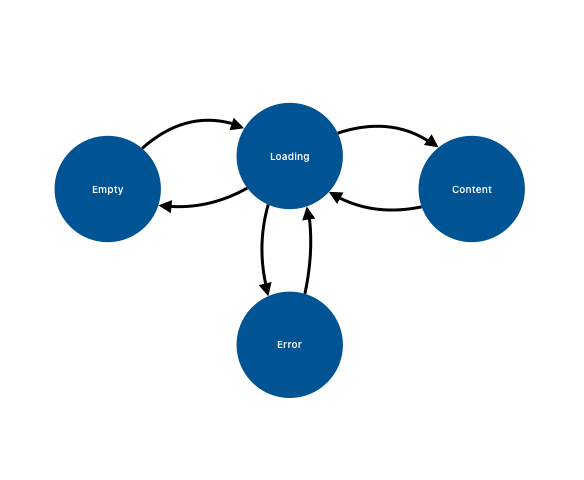

# File and Folder Browser App

[Click Here for a Video Demo!](https://youtu.be/5QUzbWT79zI) 📽️ (12m 52s)

----

## Architecture and Design Patterns
### MVVM

I built the app with SwiftUI, so an architectural pattern of Model-View-ViewModel is an obvious choice. It's well-known in the iOS community and provides valuable guidelines for separating concerns.

I focused on ensuring the model objects encapsulated the problem [domain](https://en.wikipedia.org/wiki/Domain-driven_design). A dependable set of model objects allows for extension into new platforms (watchOS, tvOS, etc.) and provides flexibility in adapting new user interfaces.

After working "horizontally" to build up the model objects, I switched to vertical- and feature-thinking. I started by building the View components and ViewModel I needed for authorization, then folder browsing, and so on.

> 💭 I find it's best to keep things "boring" when developing a production-level app. So, I could have chosen to do all "functional programming" or "redux-like architecture," but I think those might violate the [Principle of Least Astonishment](https://en.wikipedia.org/wiki/Principle_of_least_astonishment) for most developers.

### State Pattern

Because SwiftUI is a declarative UI framework, I focus on states when developing ViewModels. The [State Pattern](https://refactoring.guru/design-patterns/state) encourages encapsulating state. For complex states, having a cluster of objects conforming to a common protocol is helpful. However, I used a Swift Actor as a state machine to ensure correctness in this case. 

### Factory Pattern

Creating the ViewModels requires a few common pieces like the API Client, so I centralized this into a `ViewModelFactory`. The benefit is that it makes it easy to handle SwiftUI `NavigationLink`, but in a large app, this could start to violate the Interface Segregation Principle (the 'i' in SOLID).

### Strategy Pattern

When I examined the HTTP responses, the "Folder" and "File" objects looked similar-ish. But, from a UI/UX perspective, they would need to be treated somewhat differently. So, I decided to use [Strategy](https://refactoring.guru/design-patterns/strategy) so the Swift type-system could treat these two objects with different behavior similarly.

> ✅ I'm pleased with how this decision turned out. It allowed for more widespread use of generics in the higher layers of abstractions.

----
## Key Insights
### Object Graphs
\
Domain Model Objects

\
ViewModel Objects

### State Graphs
\
Authentication State

\
Folder and File State

